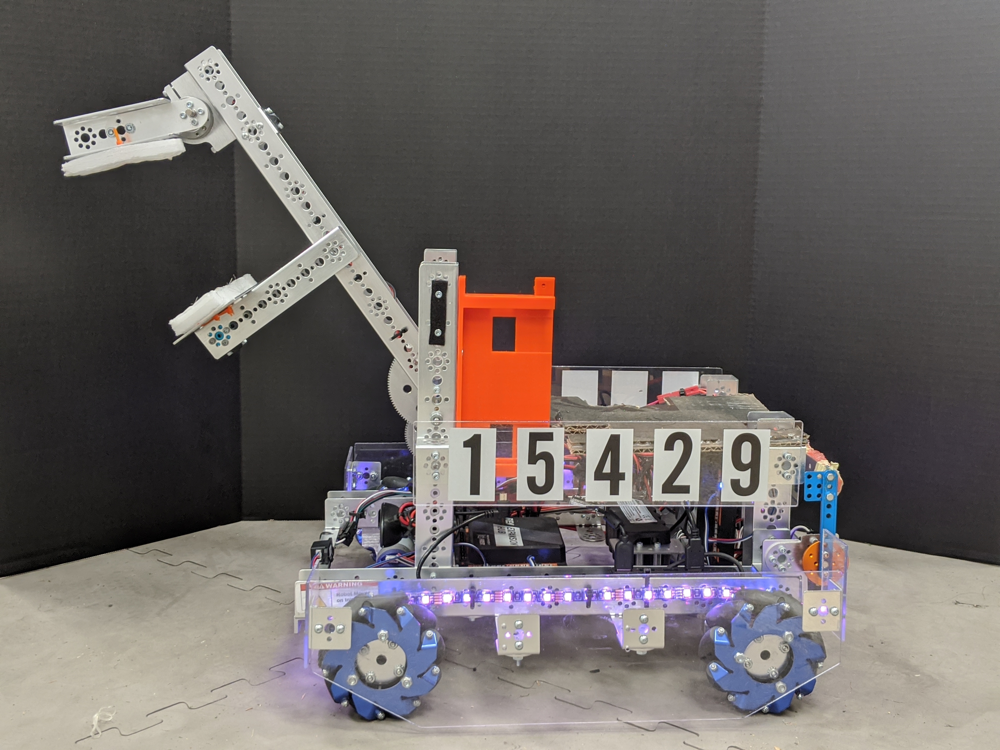
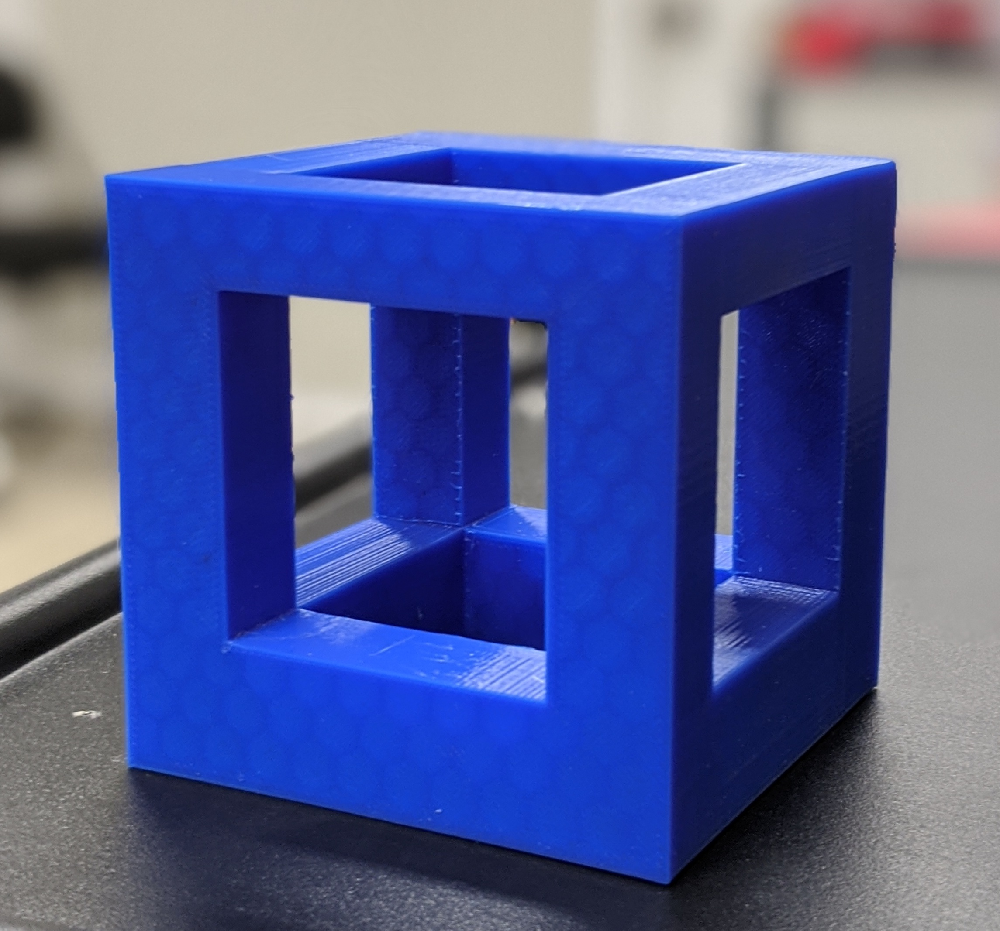
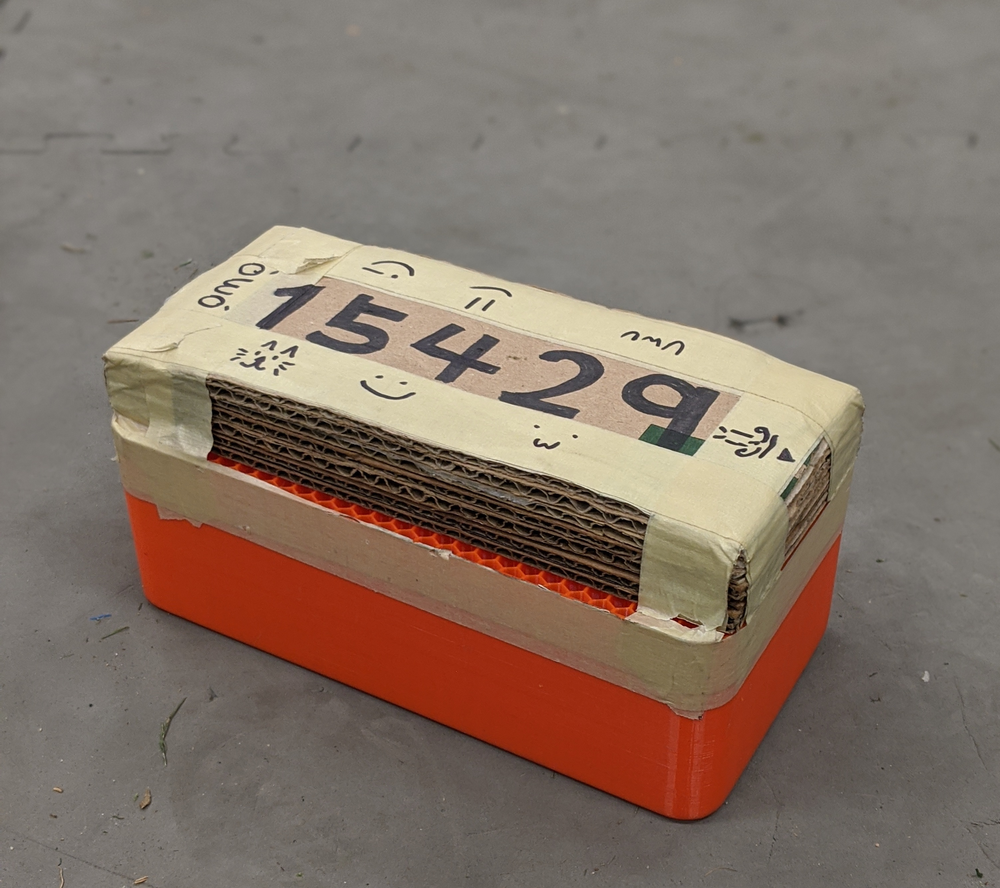
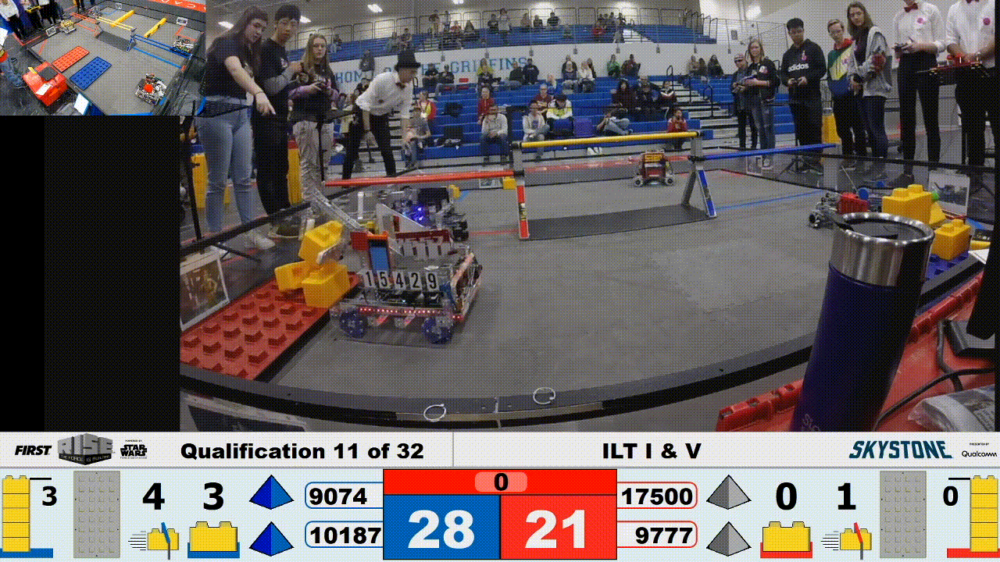

# :robot:FIRST Tech Challenge Skystone (Inter League Tournament)

FIRST Tech Challenge Team #15429 Extremophiles Code (2019-2020) [Archived on Jan 27, 2020]

- Los Angeles Inter League Tournament Semi-finalist Alliance Captain
- Ranking: 6th Place
- Awards:
  - Control Award Winner
  - Motivate Award First Runner-up
  - Think Award Second Runner-up

# Team
## Captain
Allen Lin

## Co-Captains
Macey Turbow\
Sydney Vogel\
Fletcher Lang

## Engineers
Irwin Cano\
Collin Dion

## Programmers
Hansson Ji

## Mentors
Donna Frost\
Aimie Marvel

# Photos
## Robot Design

## Capstone Design
 

# Video

